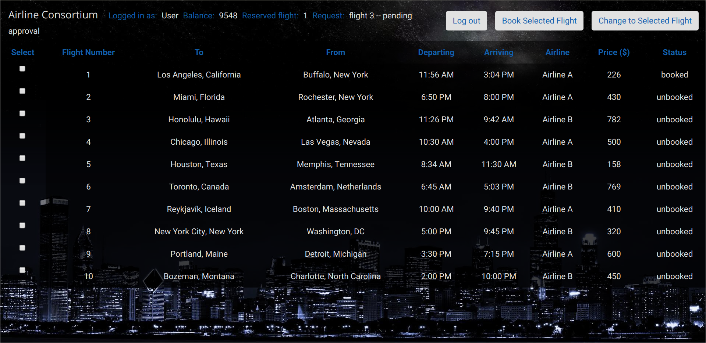
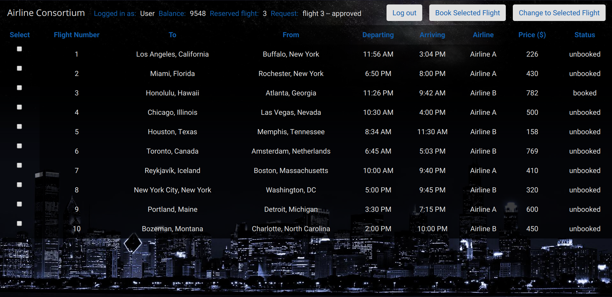
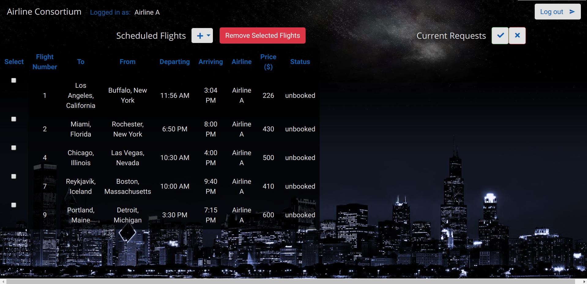
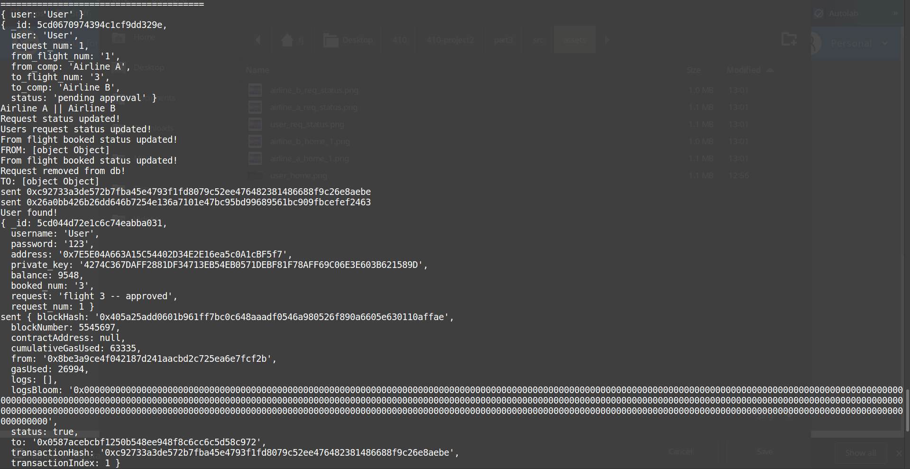

# Airline Consortium ASK

A completely decentralized application running on the Ethereum blockchain. Airline Consortium ASK is a full-stack web application where users can book flights, and request to change to other flights on other airlines. When a request gets made, airlines have the ability to settle the change with each other through the app (and settle payment between each other as well).

## How to start the application

### Linux Instructions
1. `cd` into the `part3/src/` directory.
2. Install all node dependencies by executing `npm install`.
3. Execute `npm start` to start the web application on `localhost:8080` (modifiable by editing `app.js`).

### Windows Instructions
1. Install Linux.
2. Follow Linux instructions above.

## Viewing the Solidity smart contract

Our smart contract can be viewed under `part3/contracts/airlineAsk.sol`

# NOTE TO BINA/TAs

We use `MongoDB Atlas` (cloud-hosted MongoDB) for our database in this application, which is why you don't see any prerequisites stating any database installs/daemons.

If you would like to play around with the application, you can use the logins below (each of with has around ~5 test ether):

* A user to the application => Username: `User` Password: `123`
* First airline => Username: `Airline A` Password: `123`
* Second airline => Username: `Airline B` Password: `123`

## Using the application

```NOTE: the smart contract is deployed on the Ropsten test network. Please make sure you supply a valid Ropsten account (with funds to cover transaction costs) when creating your account in the application.``` 

There are two different ways to use the application, either as a `User` or as a `Airline`. `Airlines` represent airline companies, and have paid an Ether fee to join the consortium. `Users` have the ability to view, book, and change flights while `Airlines` are able to add and remove scheduled flights, and approve/deny flight change requests from `Users`.

### User

`Users` can:
* See the currently scheduled flights being offered by any airline
* Book and pay for a flight
* Request to change flights to another (if the `User` has already booked a flight) 


Requesting to change flights to another that's offered by a different airline will route the request to the current airline for approval, and then to the requested airline for approval. At at time through the whole request process, users can see the current status of the request by checking the status bar in the users homepage.

### Airline

The airline homepage of the application allows airlines to have total management control from a single page. From this page, they can:
* Add or remove scheduled flights
* Approve or deny flight change requests initiated by one of the airlines customers  


If a user of the airline initiates a request, it will show up in the request queue as `unapproved`. Once the airline approves the request, the status is updated to `pending approval`, and will now show up in the other airlines request queue for them to approve. After they approve the request, the first airline will pay the second airline the flight cost, and the first airline will be free to handle payment from the user in anyway they see fit (added fee, pays both flight costs, restocking fees, etc). All of said transactions are recorded on the blockchain.

## Demo Scenario

Below describes `User`, who originally books `flight 1` from `Airline A`, and then requests to change to `flight 3` from `Airline B`:

* `User` has booked the flight and requested to change


* `Airline A's` request queue gets populated with the request (but not `Airline B's`)


* `Airline A` then approves the request, updating it's status (which the `User` can see in their status bar), and placing it in `Airline B's` request queue




* `Airline B` then also approves the reqest, initiating a transaction of payment between `Airline A` and `Airline B`, and clearing both of their request queues. The User's status bar gets updated to reflect the change in their flight (the flights table gets updated as well), and the request gets removed from the database.






You can view this demo transaction on etherscan [here](https://ropsten.etherscan.io/tx/0xc92733a3de572b7fba45e4793f1fd8079c52ee476482381486688f9c26e8aebe)

## Authors

* **Timothy Chase**
* **Anthony Introne**
